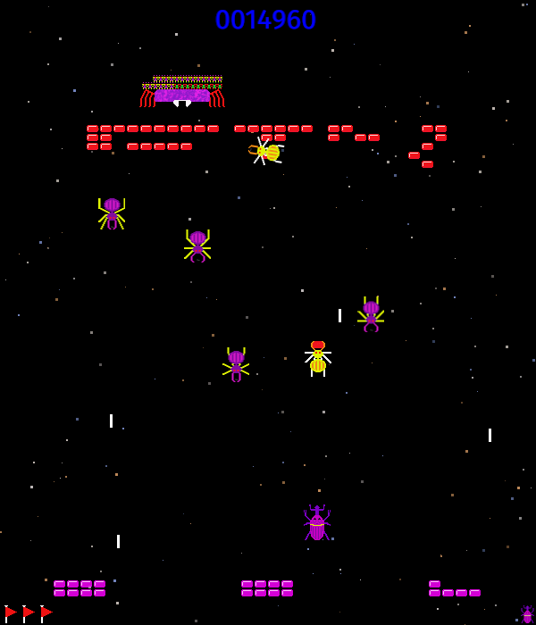

# Fin-SDL

Fin is a 2D video game which is based on a game called "Omega" which in turn is
based on a game called "The End".

The aim of the game is to pilot a ship and defend yourself against enemy
spiders. The spiders will collect bricks from the bottom of the screen and
arrange them to spell the word "FIN". The game ends once all lives have been
lost or the word is completed.

To build the game, a [Rust](https://www.rust-lang.org) development environment
is required. The Cargo tool will take care of downloading and compiling the
required Rust libraries. Also required to build the game are the SDL2
libraries. In the Arch Linux distribution the required packages are sdl2_image,
sdl2_ttf and sdl2_mixer. For other platforms these may be grouped differently
and separate dev packages may also be required.

The game is written in the Rust programming language and is built on top of
[rust-sdl2](https://github.com/Rust-SDL2/rust-sdl2) which provides bindings to
the SDL2 libraries.

The sounds have been sourced from [freesound.org](https://www.freesound.org/).
Proper attribution has been given in the file assets/sound/SOUND_LICENSE.
